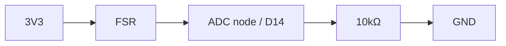

# HARDWARE_AND_PIN_PLAN.md

## ピン計画

| 機能 | 信号 | 想定 XIAO / 基板ピン | 備考 |
|---|---|---:|---|
| 既存トラックパッド I2C | SDA | D4 | DRV2605L と共用 |
| 既存トラックパッド I2C | SCL | D5 | DRV2605L と共用 |
| ハプティックドライバ | SDA | D4 | I2C 共用 |
| ハプティックドライバ | SCL | D5 | I2C 共用 |
| ハプティックドライバ | VIN | 3V3 | 電源 |
| ハプティックドライバ | GND | GND | GND |
| ハプティックドライバ | IN | GND | I2C 駆動前提で固定 Low |
| FSR 入力 | ADC node | D14 | ADC 入力 |
| Piezo 出力 | GPIO / PWM | pin pending | optional / 未確定 |

## 最小接続図

```mermaid
flowchart LR
    subgraph LP[LaLaPad / XIAO BLE Plus]
        P3V3["3V3"]
        PGND["GND"]
        PSDA["D4 / SDA"]
        PSCL["D5 / SCL"]
        PD14["D14 / ADC"]
        PPENDING["Piezo pin pending"]
    end

    subgraph HAP[DRV2605L Board]
        HVIN["VIN"]
        HGND["GND"]
        HSDA["SDA"]
        HSCL["SCL"]
        HIN["IN"]
        HOP["OUT+"]
        HOM["OUT-"]
    end

    subgraph LRA[LRA]
        LPOS["+"]
        LNEG["-"]
    end

    subgraph FSRSEC[FSR Node]
        FSR["FSR"]
        R10K["10kΩ"]
    end

    subgraph PIEZOSEC[Piezo (optional)]
        RP["series resistor TBD"]
        PIEZO["Piezo Buzzer"]
    end

    P3V3 --> HVIN
    PGND --> HGND
    PSDA --> HSDA
    PSCL --> HSCL
    PGND --> HIN

    HOP --> LPOS
    HOM --> LNEG

    P3V3 --> FSR
    FSR --> PD14
    PD14 --> R10K
    R10K --> PGND

    PPENDING --> RP
    RP --> PIEZO
    PIEZO --> PGND
```

## FSR メモ
FSR は単純なスイッチではない。
**分圧回路**として扱い、ADC はノード電圧を読む。

### FSR 部分回路


## Piezo メモ
- Piezo は現時点では optional
- 出力ピン未確定のため、配線・抵抗値・必要ならトランジスタ段も含めて未確定
- D16 は使わない
- 安全な別ピン候補が確認できるまでは実装前提にしない

## D14 の扱い
- D14 は FSR 用 ADC 入力として使う前提で進める
- ADC / 入力用途を基本とし、不要なデジタル出力用途には使わない
- 現行 firmware target は `seeeduino_xiao_ble` のため `xiao_d 14` では参照できない前提で扱う
- 実装上は、XIAO BLE Plus の D14 に対応する raw ADC として `ADC7` を使う

## D16 の扱い
- D16 は使わない
- BAT 系ラベルを持つため、Piezo などの能動出力ピンとしては採用しない

## ハード確認チェックリスト
- 現行ファームウェアで `ADC7` 参照が実機の D14 配線と一致しているか確認する
- DRV2605L 追加後も I2C バスが安定するか確認する
- DRV2605L 追加後も既存トラックパッド動作が変わらないか確認する
- 選んだ機械構成で FSR の ADC レンジが安定するか確認する
- Piezo を使う場合は、安全な別ピン候補を確認する
